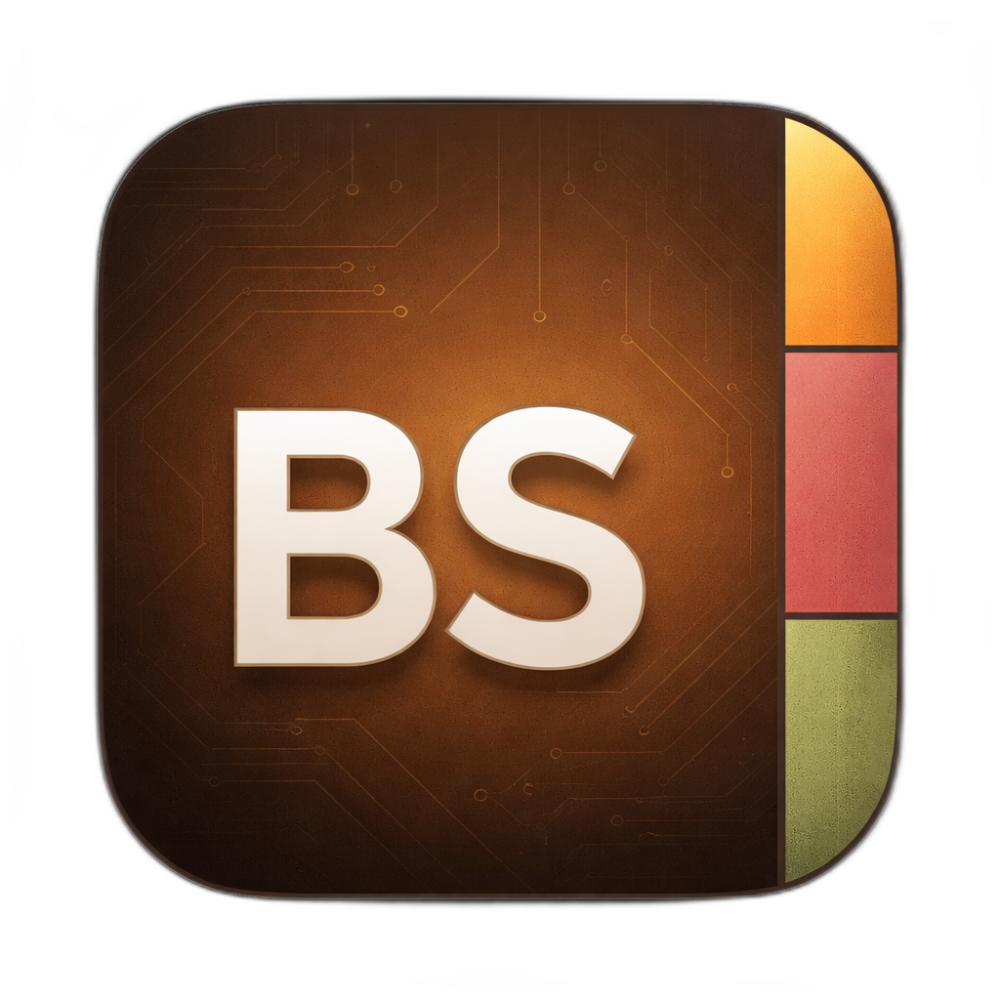
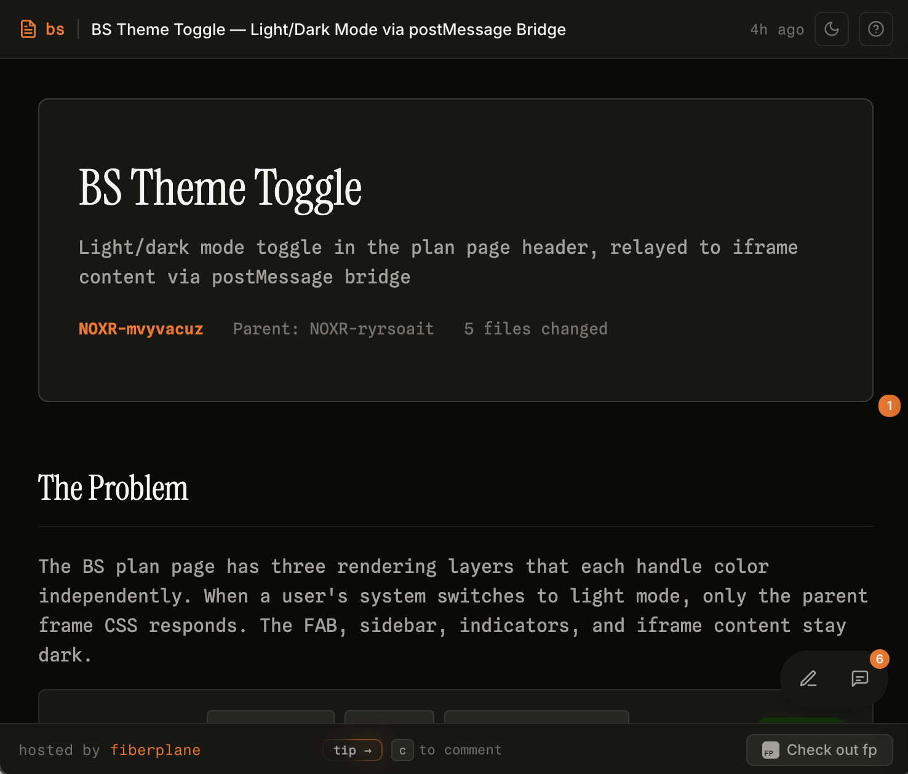

<p align="center">
  
</p>

<h3 align="center">fp</h3>

<p align="center">
  An Agent skill for generating rich, visual plans 
  <br />
  and publishing them to shareable urls to collect feedback.
</p>

---

<p align="center">
  
</p>
<p align="center"><em>Some example brainstorm bs published by bs</em></p>

Plans are self-contained with diagrams, tables, and structured layouts using a consistent design language. Published plans support inline comments and real-time cursor presence for collaborative review.

## Install

### With `npx skills` (recommended)

```bash
npx skills add fiberplane/bs --skill bs
```

### Manual (Claude Code)

Clone the repo and copy the skill into Claude Code's skills directory:

```bash
git clone https://github.com/fiberplane/bs.git /tmp/fiberplane-bs
mkdir -p ~/.claude/skills
cp -R /tmp/fiberplane-bs/skills/bs ~/.claude/skills/bs
```

### Manual (`.agents`)

Clone the repo and copy the skill into your `.agents` skills directory:

```bash
git clone https://github.com/fiberplane/bs.git /tmp/fiberplane-bs
mkdir -p ~/.agents/skills
cp -R /tmp/fiberplane-bs/skills/bs ~/.agents/skills/bs
```

## Usage

Once installed, ask the agent to brainstorm or create a visual plan:

```
> brainstorm an auth system migration plan
> bs: architecture overview for the new API gateway
> create a visual plan for the database refactor
```

The agent will generate a self-contained plan and publish it to a shareable URL.

## How it works

When you ask the agent to brainstorm, it generates a self-contained plan — all CSS, JS, and Mermaid diagrams are inlined. The agent then publishes the content to the bs hosting service via a simple POST to `https://app.fp.dev/bs/api/plans`, and you get back a shareable URL like `https://app.fp.dev/bs/a8k2m1x`.

**Anonymous plans** (no credentials) expire after 3 days and include a claim token for later ownership or deletion. **Authenticated plans** (if you are logged in with the [`fp`](https://fp.dev) CLI, it will save your plan) persist indefinitely and can be updated with new versions.

The published page renders your plan in a sandboxed iframe with theme support, inline commenting, and real-time cursor presence for anyone viewing the link.

## What you get

- **Visual plans** — structured layouts with cards, tables, file trees, and diagrams
- **Mermaid diagrams** — flowcharts, sequence diagrams, architecture views
- **Adapts to light/dark mode** — clean, readable aesthetic with light theme support
- **Shareable URLs** — publish to `app.fp.dev/bs/` with one command
- **Inline comments** — collaborators can leave feedback anchored to specific elements
- **Cursor presence** — see who's viewing the plan in real-time

## License

MIT
